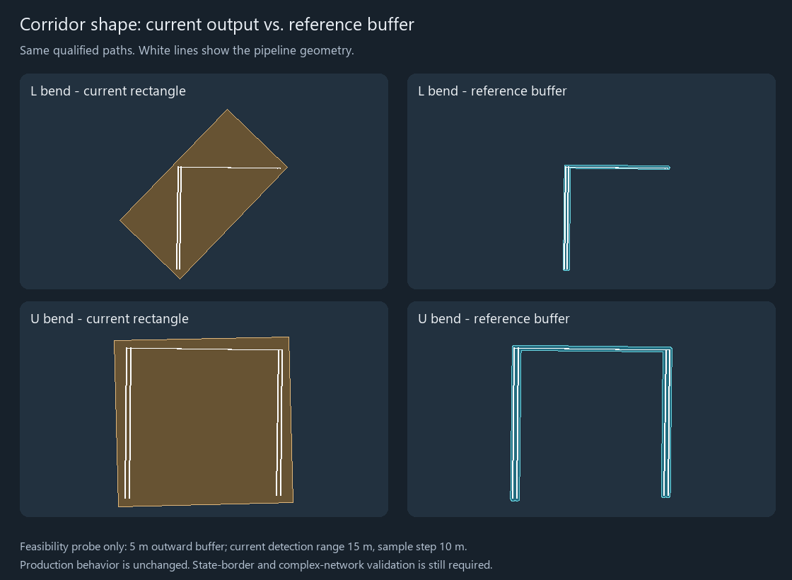

# Historical corridor buffer feasibility evidence

Historical planning evidence, September 18, 2026, recorded before production
implementation. The path-buffer corridor implementation has since been completed.
See the [implementation report](../corridor-buffer-implementation.md) and
[release-readiness audit](../RELEASE_READINESS_AUDIT.md) for implementation and
platform verification; the [runbook](../../../CORRIDOR_GEOMETRY_IMPLEMENTATION_PLAN.md)
retains the design and acceptance criteria. The measurements below describe the
original feasibility probe, not the current production display.



The probe uses two paths translated 8 m relative to one another near longitude
-100, latitude 40. Analysis settings: 15 m detection range, 10 m sample step,
50 m minimum parallel length, default angular tolerance. It extracts the actual
qualifying source spans and sends them to the reference repository's fixed-buffer
routine, with 5 m padding per path. It does not change qualification or production
code. The geographic results are compared in the reference routine's local CRS.

| Shape | Qualified length | Pre-implementation display | Pre-implementation area | Reference buffered area |
| --- | ---: | --- | ---: | ---: |
| L bend | 590 m | Oriented rectangle | 111,367.928 m² | 8,445.005 m² |
| U bend | 890 m | Oriented rectangle | 114,745.533 m² | 13,752.448 m² |

Both candidate polygons are valid and contain all of those qualified spans.
These small constructed examples demonstrate potential improvement, not a
production accuracy guarantee. They do not prove state clipping, holes, dateline
handling, cancellation, resource bounds or serialization. The reference builder's
hole filling/auto-connect behavior must not be carried into the implementation.

- [Probe values](comparison.json).
- [Probe source](probe.py): run with the repository virtual environment from the
  pipeline repository root. It requires the inspected reference checkout at the
  absolute path declared in the script and Pillow; it writes only to
  `.validation-output/corridor-reuse/`. It is an exploratory reproduction, not a
  production dependency or a CI test.
- [Source fingerprints and environment](environment.json).

Application baseline at the time of this probe: 61 passed, 5 native GUI cases
deselected, 4.89 seconds:

```powershell
.venv/Scripts/python.exe -m pytest tests/test_corridor_geometry.py tests/test_corridor_coverage.py tests/test_corridor_visibility.py tests/test_corridor_launch.py tests/test_state_geometry.py tests/test_geography_export.py tests/test_export_workbook.py -q -m 'not native_gui'
```

The independent reference review also ran its existing polyline/buffer-hardening
tests (15 passed). Those historical results only established feasibility;
subsequent implementation and release-gate evidence is linked above.
